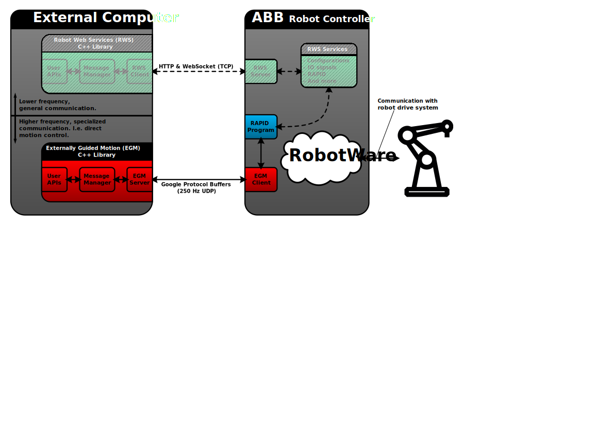

# abb_libegm

## ROS Distro Support

|         | Indigo | Jade | Kinetic |
|:-------:|:------:|:----:|:-------:|
| Branch  | [`master`](https://github.com/ros-industrial/abb_libegm/tree/master) | [`master`](https://github.com/ros-industrial/abb_libegm/tree/master) | [`master`](https://github.com/ros-industrial/abb_libegm/tree/master) |
| Status  |  supported | supported |  supported |
| Version | [version](http://repositories.ros.org/status_page/ros_indigo_default.html?q=abb_libegm) | [version](http://repositories.ros.org/status_page/ros_jade_default.html?q=abb_libegm) | [version](http://repositories.ros.org/status_page/ros_kinetic_default.html?q=abb_libegm) |

## Travis - Continuous Integration

Status: 

## ROS Buildfarm

|         | Indigo Source | Indigo Debian | Jade Source | Jade Debian |  Kinetic Source  |  Kinetic Debian |
|:-------:|:-------------------:|:-------------------:|:-------------------:|:-------------------:|:-------------------:|:-------------------:|
| abb_libegm |  |  |  |  |  |  |

## Important Note

RobotWare `6.07` introduced major changes in the EGM communication protocol, and this library has not been updated to support those changes yet.

**Avoid using this library with RobotWare 6.07 at the moment.**

## Overview

A C++ library for interfacing with ABB robot controllers supporting *Externally Guided Motion* (EGM). See the *Application manual - Controller software IRC5* for a detailed description of what EGM is and how to use it.

See [abb_librws](https://github.com/ros-industrial/abb_librws) for a companion library that interfaces with *Robot Web Services* (RWS).

### Sketch

The following is a conceptual sketch of how this EGM library can be viewed, in relation to an ABB robot controller as well as the RWS companion library mentioned above. 

### Requirements

* RobotWare versions between `6.0` and `6.06.01` (higher versions are to be considered incompatible at the moment).
* A license for the RobotWare option *Externally Guided Motion* (`689-1`).

### Dependencies

* [Boost C++ Libraries](https://www.boost.org)
* [Google Protocol Buffers](https://developers.google.com/protocol-buffers)

### Limitations

This library is intended to be used with the UDP variant of EGM, and it supports the following EGM modes:

 * Joint Mode
 * Pose Mode

### Recommendations

 * This library has been verified to work with RobotWare `6.06.01`. Other version are expected to work, but this cannot be guaranteed at the moment.
 * It is a good idea to perform RobotStudio simulations before working with a real robot.
 * It is prudent to familiarize oneself with general safety regulations (e.g. described in ABB manuals).
