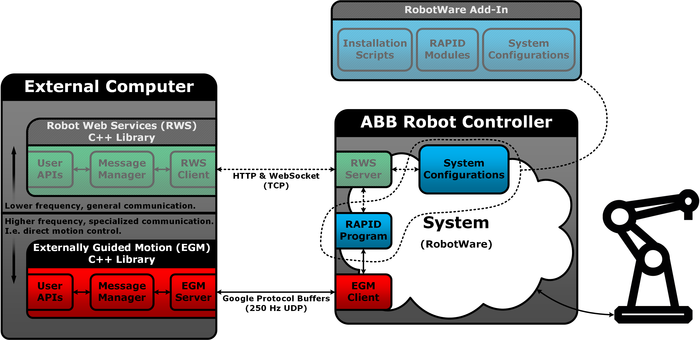

# abb_libegm

## Important Note

RobotWare 6.07 introduced major changes in the EGM communication protocol, and this library has not been updated to support those changes yet.

**I.e. avoid using this library with RobotWare 6.07 at the moment.**

## Overview

A C++ library for interfacing with ABB robot controllers supporting Externally Guided Motion (EGM).

See [abb_librws](https://github.com/ros-industrial/abb_librws) for a companion library that interfaces with RWS.

### Sketch

The following is a conceptual sketch of how this EGM library can be viewed, in relation to an ABB robot controller as well as the RWS companion library mentioned above. 

### Requirements

* RobotWare 6.0 or higher.
* A license for the RobotWare option Externally Guided Motion [689-1].

### Limitations

This library is intended to be used with the UDP variant of EGM, and it supports the following EGM modes:
* Joint Mode.
* Pose Mode.

### Recommendations

* The current version of this library is recommended to be used with **RobotWare 6.06.01**.
* It is recommended to perform RobotStudio simulations before working with a real robot.
* It is also recommended to familiarize oneself with general safety regulations (e.g. described in ABB manuals).